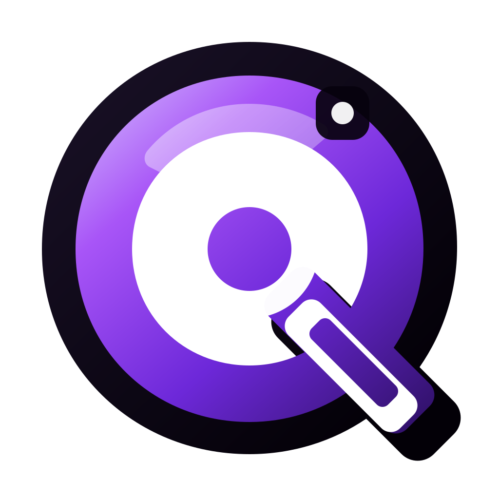
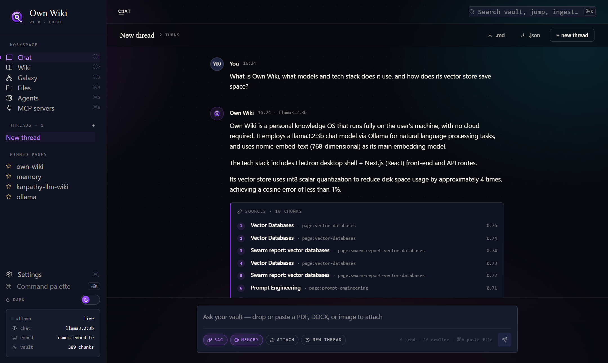
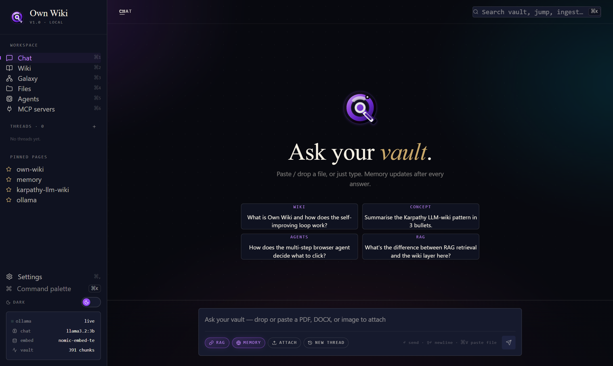
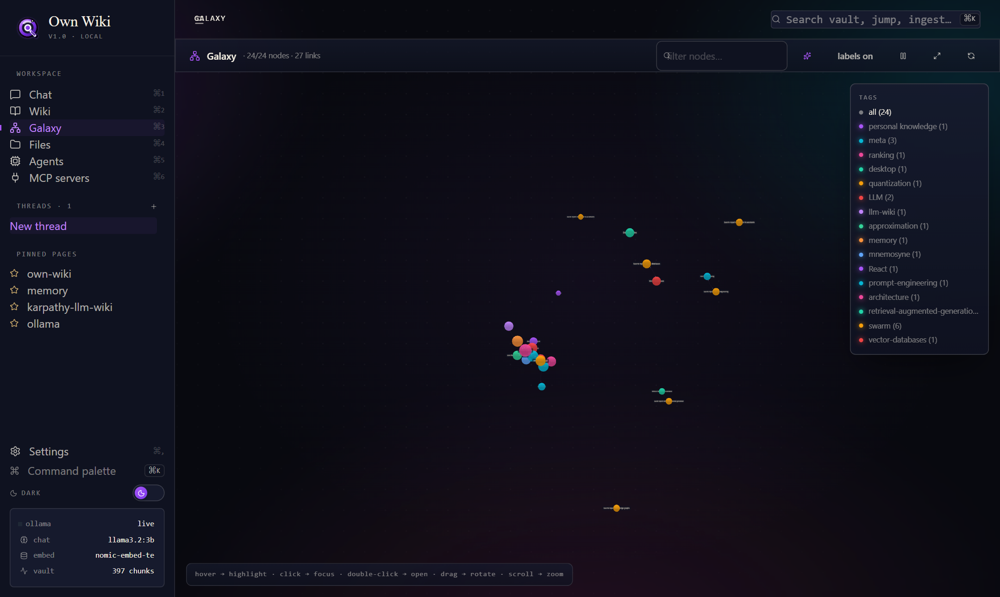
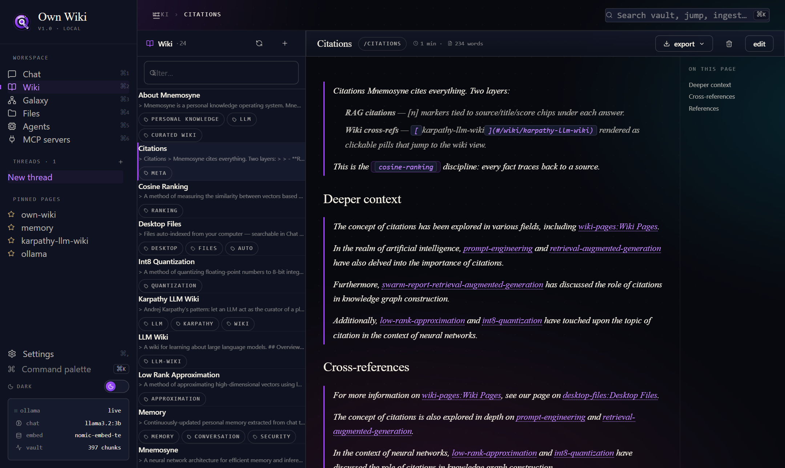
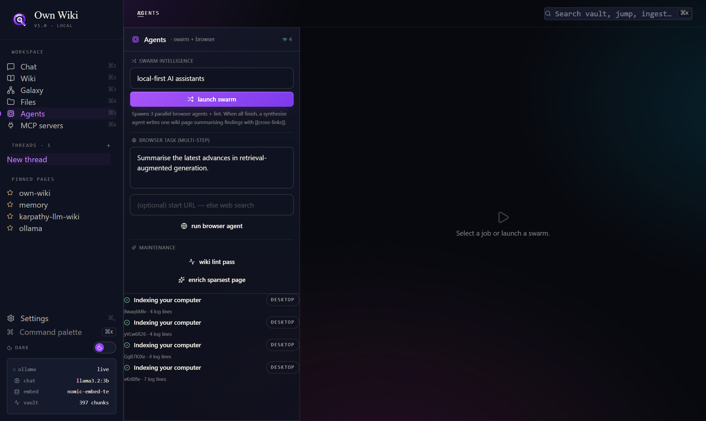
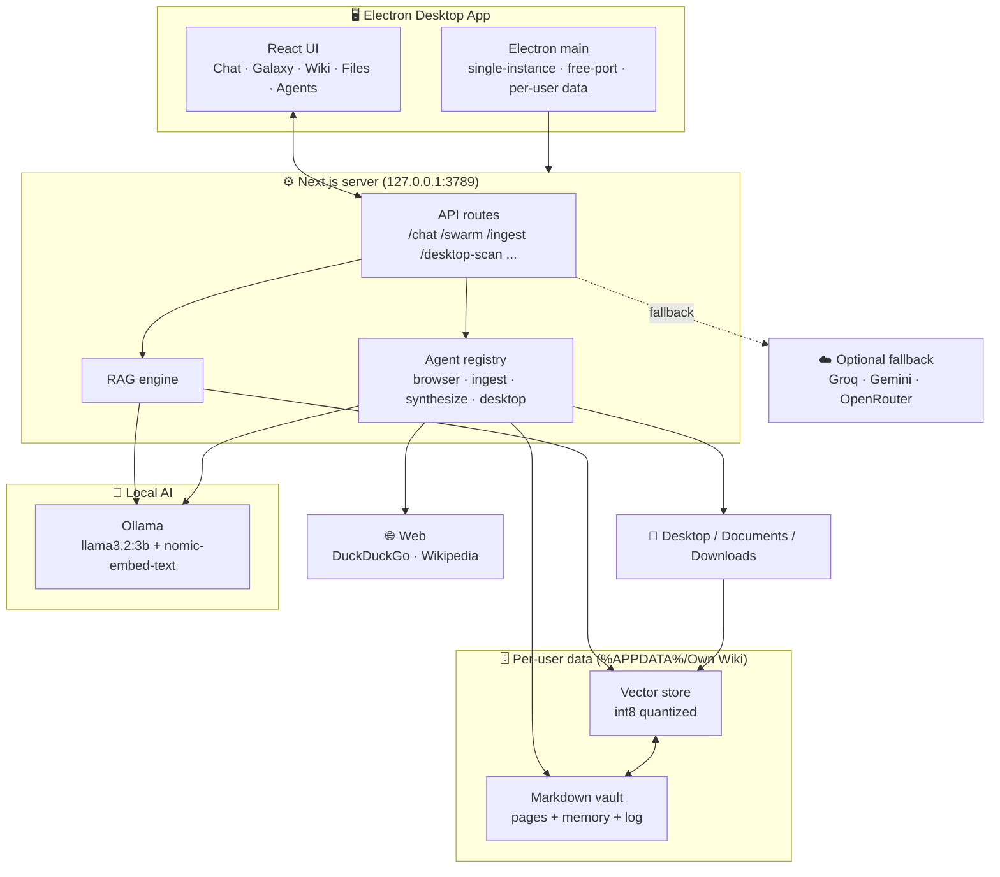
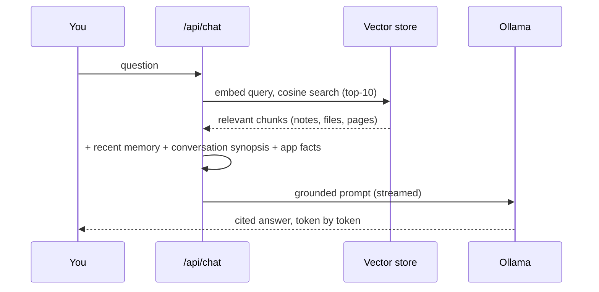
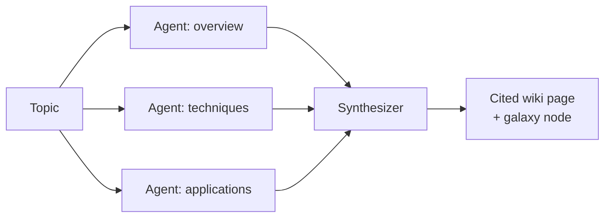

<div align="center">



# Own Wiki

### Your second brain — a local-first, AI-powered personal knowledge OS.

**Chat with your notes and files. Watch your knowledge organize itself into a living galaxy. All on your machine. No cloud required.**

[](https://github.com/vaibhav4046/mnemosyne/releases/latest)
[](https://github.com/vaibhav4046/mnemosyne/releases/latest)
[](#-privacy--security)
[](#-tech-stack--why)

<br/>



</div>

---

## What is this?

**Own Wiki** is a desktop app that turns everything you know — your notes, your documents, your conversations — into a private, searchable, self-organizing knowledge base, powered by a **local LLM**.

It's inspired by Andrej Karpathy's *"LLM wiki"* idea and tools like Notion AI / Qyntra — but it runs **entirely on your computer**. Your data never leaves the machine. No subscription, no API key required, no telemetry.

Ask it a question and it answers from *your* knowledge, with citations. Drop in a PDF and it reads it. Give a research topic to the **agent swarm** and it investigates in parallel and writes you a cited brief. And the whole web of what you know renders as an interactive 3D **galaxy** you can fly through.

> **TL;DR** — It's a ChatGPT-for-your-own-stuff that you actually own.

---

## ✨ Highlights

| | |
|---|---|
| 🧠 **RAG chat over your vault** | Streaming answers grounded in your notes + files, with inline `[n]` citations. |
| 🌌 **Knowledge galaxy** | A 3D force-graph of every note and how they connect — hover to highlight, click to fly in. |
| 🤖 **Agent swarm** | Spawn parallel research agents that search the web, ground their findings, and synthesize a cited wiki page. |
| 🗂️ **Desktop auto-index** | Reads your Desktop / Documents / Downloads automatically — ask about a file with zero manual import. |
| 💾 **Long-term memory** | Extracts atomic facts after each chat, so it remembers you across conversations. |
| ⚡ **int8 vector store** | Custom quantized embeddings — ~4× smaller on disk, <1% cosine error, zero native deps. |
| 🔌 **Multi-provider** | Ollama by default; optional fallback to Groq / Gemini / OpenRouter with a pasted key. |
| 🎨 **Premium UI** | Light + dark themes, animated background, resizable panes, command palette (`⌘K`). |

---

## 📸 Screenshots

<table>
  <tr>
    <td width="50%"><br/><sub><b>Ask your vault</b> — clean, fast chat home.</sub></td>
    <td width="50%"><br/><sub><b>Galaxy</b> — your knowledge as a living graph.</sub></td>
  </tr>
  <tr>
    <td width="50%"><br/><sub><b>Wiki</b> — auto-curated pages with backlinks.</sub></td>
    <td width="50%"><br/><sub><b>Agents</b> — parallel swarm research, live.</sub></td>
  </tr>
</table>

---

## 🏗️ Architecture

Own Wiki is one Electron app that boots a Next.js server on `127.0.0.1` and talks to a local Ollama runtime. Everything — vault, vectors, memory — lives in a per-user folder under `%APPDATA%`.



### How a chat answer is built (RAG)



### How the swarm works



Each browser agent runs deterministic **search → fetch → grounded-summarise** (SSRF-guarded), so even a small local model produces accurate, cited output. The synthesizer always renders each agent's grounded answer, then layers on cross-references and key insights.

---

## 🧰 Tech stack & why

| Layer | Choice | Why |
|---|---|---|
| Shell | **Electron** | One installable `.exe`; native filesystem access for desktop indexing. |
| Front + back | **Next.js 16 (App Router) + React 19** | One framework for UI **and** API routes; ships as a standalone server. |
| Inference | **Ollama** (`llama3.2:3b`) | Free, local, private. No key, no cloud, works offline. |
| Embeddings | **nomic-embed-text** (768-dim) | Strong local embeddings for RAG. |
| Vector store | **Custom, int8 quantized** | ~4× smaller on disk, <1% cosine error, pure-JS (no native deps to break the portable build). |
| Graph | **react-force-graph-3d + three.js** | GPU-accelerated 3D galaxy with bloom. |
| State | **Zustand** | Tiny, fast, persisted. |
| Fallback AI | **Groq / Gemini / OpenRouter** | Optional one-paste upgrade to bigger models. |

---

## 🚀 Quick start

### Option A — just run it (Windows)

1. Download **`OwnWiki-1.0.0-portable.zip`** from the [latest release](https://github.com/vaibhav4046/mnemosyne/releases/latest).
2. Unzip anywhere and double-click **`Own Wiki.exe`**.
3. (Recommended) Install [Ollama](https://ollama.com) and pull the models for full local power:
   ```bash
   ollama pull llama3.2:3b
   ollama pull nomic-embed-text
   ```
   > No Ollama? The app still opens — add a free **Groq/Gemini** key in **Settings** and it works via the cloud fallback.

### Option B — run from source

```bash
git clone https://github.com/vaibhav4046/mnemosyne.git
cd mnemosyne
npm install
npm run dev          # http://localhost:3000

# build the desktop app
npm run build:exe    # -> dist-electron/
```

---

## 📖 How to use

**💬 Chat** — Ask anything about your notes and files. Toggle **RAG** (retrieve from your vault) and **Memory** (remember facts) per thread. Drop or paste a PDF/DOCX/image right into the composer to discuss it. Every thread is saved in the sidebar; export any thread to `.md` / `.json`.

**🌌 Galaxy** — Your whole vault as a 3D graph. **Hover** a node to light up its neighbours, **click** to fly in and focus, **double-click** to open the page. Filter by tag, search nodes, toggle glow / labels / auto-rotate.

**📚 Wiki** — Browse the auto-curated pages the AI writes from your sources. Backlinks, table of contents, reading time. Create or edit pages by hand too. Export to MD / PDF / CSV / DOCX.

**🗂️ Files** — Browse your Desktop / Documents / Downloads in-app. They're **auto-indexed** on launch, so chat can already answer about them — no manual import. Click any file to preview, or ingest a whole folder.

**🤖 Agents** — Type a topic and launch a **swarm**: parallel agents research different angles, then synthesize one cited wiki page that drops straight into your galaxy. Watch each agent's progress live.

**🔌 MCP & Settings** — Connect MCP tool servers (command-allowlisted). In Settings, pick your provider/model, paste optional cloud keys (masked, stored locally), switch theme.

> **Shortcuts:** `⌘/Ctrl + K` command palette · `⌘/Ctrl + 1–7` jump between views.

---

## 🔐 Privacy & security

- **Local-first.** Vault, vectors, and memory live only in `%APPDATA%/Own Wiki`. Nothing is uploaded unless *you* enable a cloud provider.
- **Per-user data.** Whoever installs it sees only their own profile.
- **Hardened APIs.** SSRF guard on all outbound fetches, CSRF middleware, MCP command allowlist, path-traversal + realpath checks on file access, strict CSP.
- **Keys stay secret.** Cloud keys are masked in the UI, stored locally, never logged or sent to the browser.

---

## 🗺️ Roadmap

- [ ] Real-time file-watching for instant re-index
- [ ] 2D/3D galaxy toggle + timeline view
- [ ] Per-vault encryption at rest
- [ ] macOS + Linux builds

---

## 📂 Project structure

```
src/
  app/api/        chat · swarm · ingest · desktop-scan · reindex-pages · wiki · files · providers ...
  lib/
    vector.ts     int8 quantized vector store
    wiki.ts       markdown vault engine
    providers.ts  multi-provider LLM layer
    agents/       browser · ingest · synthesize · desktop · registry
  components/     chat · graph (galaxy) · wiki · files · agents panels
electron/         main.cjs (desktop shell)
scripts/          brutal-qa · provider-qa · ui-walk · repack
```

---

<div align="center">

Built by **[Vaibhav Lalwani](https://github.com/vaibhav4046)** · Powered by local AI · Made to be owned.

<sub>If this is useful, a ⭐ goes a long way.</sub>

</div>
