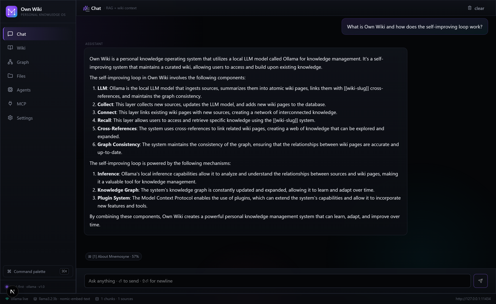
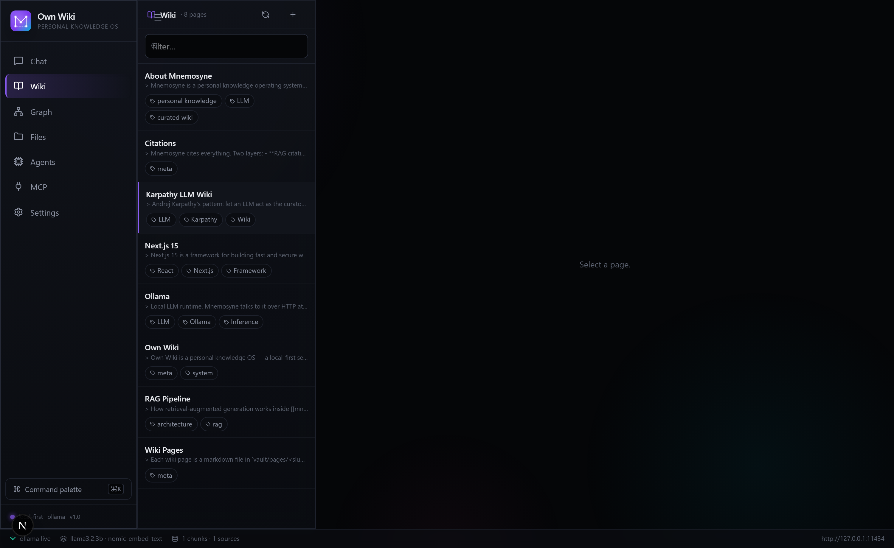
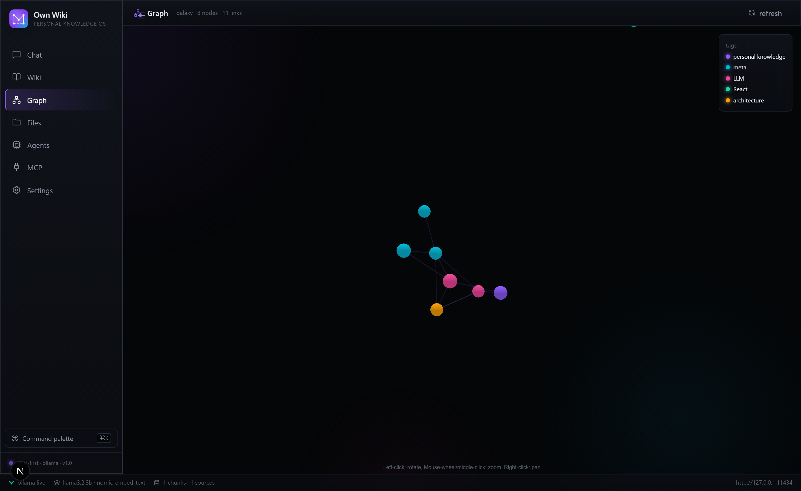
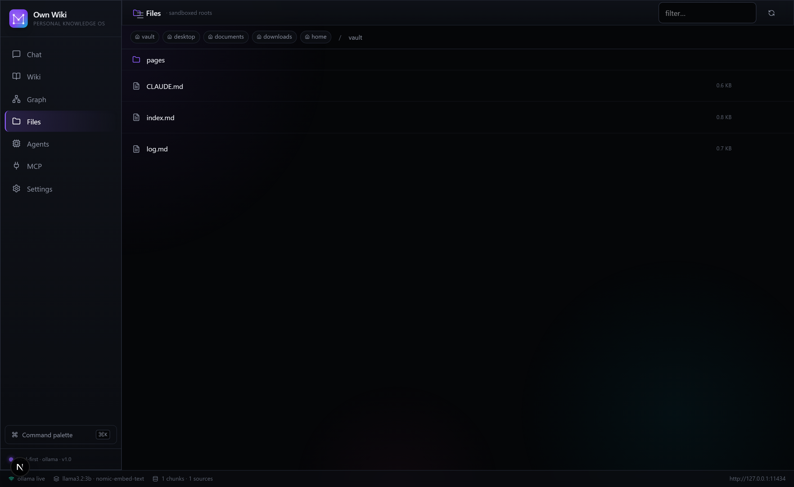
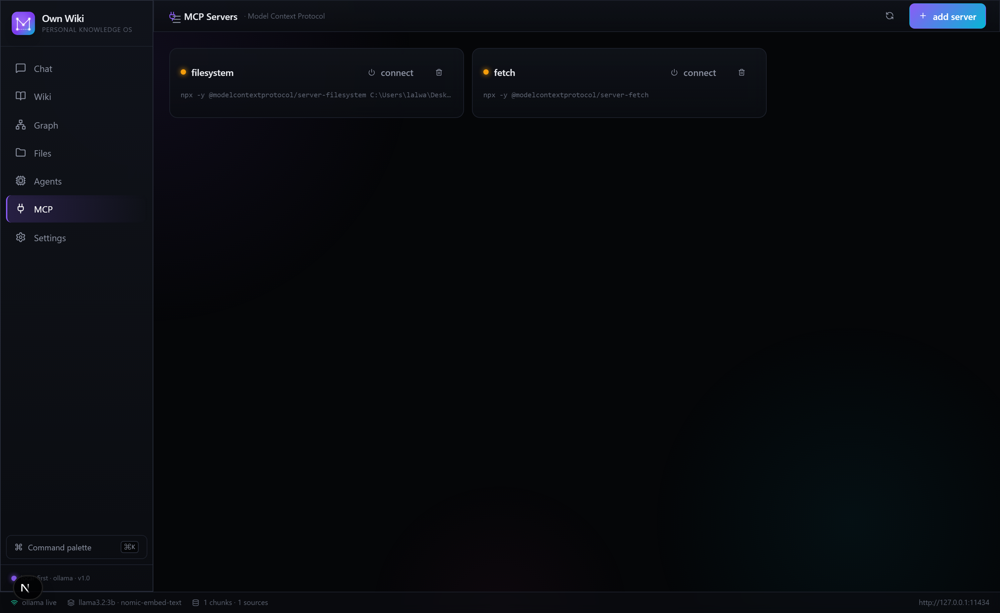
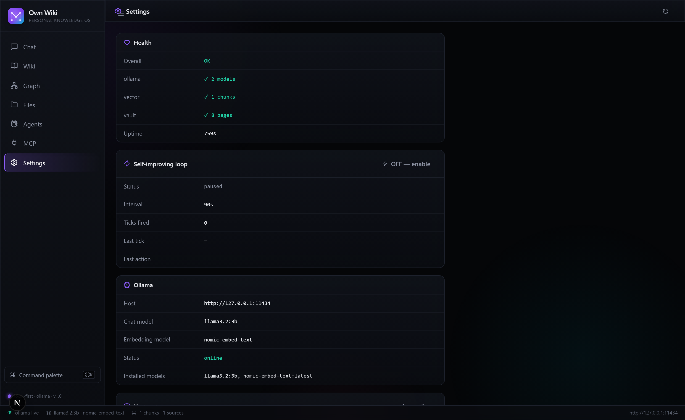
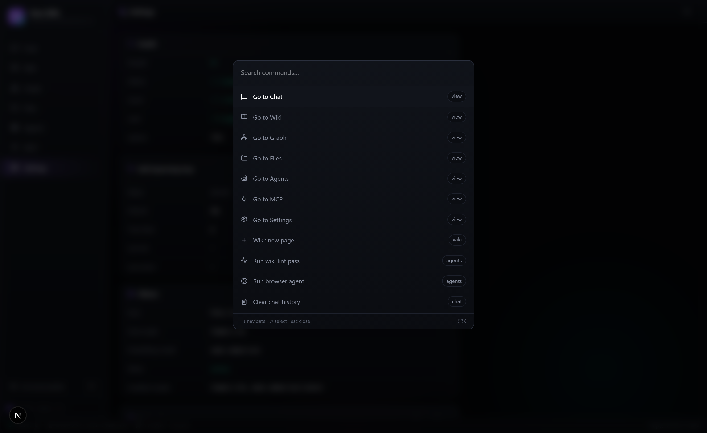

<div align="center">
  
  <h1>Own Wiki</h1>
  <p><strong>A local-first self-improving AI memory wiki — your own Wikipedia, curated by a local LLM, packaged as a Windows .exe.</strong></p>
  <p>
    
    
    
    
    
    
  </p>
</div>

---

Mnemosyne is a web application (not a static site) that runs a small Operating-System-like environment for your knowledge. The LLM is the librarian: it ingests sources, writes and maintains an interlinked Markdown wiki, retrieves cited context for chat, and runs background agents in parallel — all on your own machine via [Ollama](https://ollama.com).

Inspired by Andrej Karpathy's "LLM Wiki" pattern and the recall surfaces of [Qyntra](https://qyntra-app.vercel.app/), Mnemosyne combines a plain-Markdown vault, a vector-RAG layer, a 3D galaxy graph, and a multi-agent swarm into a single dark, sleek workspace.

---

## Screenshots

| Chat (streaming RAG with citations) | Wiki (interlinked Markdown pages) |
| --- | --- |
|  |  |

| Galaxy (3D force graph of links) | Files (sandboxed desktop ingestion) |
| --- | --- |
|  |  |

| Agents (parallel swarm dashboard) | MCP servers (plug in tools) |
| --- | --- |
|  |  |

| Settings (live health + introspection) | Command palette (⌘K) |
| --- | --- |
|  |  |

---

## Features

- **Self-improving loop** — toggle on; a server-side daemon ticks every 90s and either enriches the sparsest wiki page or runs a lint pass, growing the memory unattended.
- **Multi-step browser agent (Claude-Cowork-style)** — give it a natural-language task and a start URL; an LLM planner loop iterates `navigate / click / fill / scroll / extract` up to 15 steps until it returns a thorough answer with citations.
- **Swarm intelligence with synthesis** — `launch swarm` fans out 3 parallel browser agents on different angles of a topic + a lint pass; when all complete, a `synthesize` agent fuses the findings into a single wiki page with cross-references back to every contributing agent.
- **Streaming RAG chat** — every answer is grounded in cosine-retrieved context from your local vector store; citations rendered inline as chips; `[[wiki-slug]]` rendered as clickable pills.
- **Wiki as code** — `vault/pages/*.md` files with YAML front-matter. Pages are dense (3-5 sections, ## See also, ## Sources), properly spaced, and richly cross-linked. Open in any editor.
- **LLM curator** — ingest spawns an agent that produces 4-8 detailed pages with structured sections, then reuses existing slugs as cross-references.
- **3D Galaxy** — every `[[link]]` becomes an edge in a `react-force-graph-3d` scene; nodes colour-coded by tag, click jumps to the page.
- **Sandboxed desktop ingest** — path-jailed FS layer exposes Desktop / Documents / Downloads / vault as roots; one click sends a file through `pdf-parse` / `mammoth` and into the wiki.
- **MCP client** — connect any stdio MCP server (filesystem, fetch, custom) and expose its tools to the agents.
- **Local-first by default** — Ollama at `127.0.0.1:11434`; no keys, no telemetry, no cloud.
- **Windows .exe** — packaged via Electron + electron-builder. The .exe boots the Next.js standalone server on `127.0.0.1:3789` and opens a native window.

---

## Architecture

```
+--------------------+        +--------------------+
|   Next.js shell    | <----- |     Zustand        |
|  (App Router, RSC) |        |  view + chat store |
+----------+---------+        +--------------------+
           |
           |  fetch/SSE
           v
+--------------------+        +-----------------------------+
|     API routes     | -----> |  Agent registry (p-queue)   |
|   /api/chat (SSE)  |        |  ingest · lint · query ·    |
|   /api/ingest      |        |  browser · file · MCP       |
|   /api/wiki[/slug] |        +--------------+--------------+
|   /api/agents/...  |                       |
|   /api/files       |          +------------+-------------+
|   /api/mcp         |          |                          |
|   /api/models      |          v                          v
+--------------------+     +---------+              +-------------+
                           |  Wiki   |              |   Vector    |
                           | vault/  |              |  store      |
                           |   *.md  |              | JSON+cosine |
                           +---------+              +-------------+
                                |                          ^
                                |                          |
                                v                          |
                           +----------+              +-----------+
                           |  Ollama  |  embed/chat  |  chunker  |
                           |  HTTP    |<-------------+           |
                           +----------+              +-----------+
                                ^
                                |
                          +-----+------+
                          | Playwright |
                          | (chromium) |
                          +------------+
```

---

## Tech stack & why

| Layer | Choice | Reason |
| --- | --- | --- |
| Framework | **Next.js 15 (App Router, Turbopack)** | One process serves UI + server actions + SSE. Server components keep the bundle small while still letting us call `node:fs` and `playwright` server-side. |
| UI | **React 19 + Tailwind 4** | Streaming-friendly, lets us drive token-level updates without ceremony. Tailwind 4 gives us CSS variables for the dark theme with no class bloat. |
| State | **Zustand** | Minimal store, no provider boilerplate, plays nicely with selector subscriptions for live agent updates. |
| Icons | **lucide-react** | Crisp single-file SVG icons that match the dark aesthetic. |
| Markdown | **react-markdown + remark-gfm + gray-matter** | Standard pipeline; gray-matter parses YAML front-matter so the wiki layer can read/write the same files an editor would. |
| 3D viz | **react-force-graph-3d + three.js** | The "galaxy" view of the wiki — Qyntra's signature recall surface — rendered with WebGL for thousands of nodes at 60fps. |
| LLM | **Ollama (`llama3.2:3b` chat, `nomic-embed-text` embed)** | Free, local, fast on a laptop; no API keys; streaming over loopback is sub-100ms TTFT. |
| Vector store | **JSON file + cosine similarity (in-memory cache)** | Zero native deps (no `better-sqlite3` build pain on Windows), portable across machines. Adequate for tens of thousands of chunks; swap for sqlite-vec or LanceDB later. |
| Concurrency | **p-queue** | Tiny, dependable parallel queue with a single concurrency knob — perfect for an agent swarm. |
| Browser agent | **Playwright (headless chromium)** | Mature DOM access + screenshots; the agent loads a URL, summarises the main content with the local LLM, and returns the screenshot inline. |
| File parsers | **pdf-parse, mammoth** | PDF and `.docx` ingestion; plain-text fallback for everything else. |
| Tool protocol | **`@modelcontextprotocol/sdk`** | Standard stdio MCP client — drop in `@modelcontextprotocol/server-filesystem`, `server-fetch`, or anything custom. |

---

## Vault schema

```
vault/
├── CLAUDE.md          ← schema + conventions for the LLM curator
├── index.md           ← auto-rebuilt catalog of pages
├── log.md             ← append-only ledger of ingests/queries/lints
└── pages/
    ├── mnemosyne.md
    ├── ollama.md
    ├── karpathy-llm-wiki.md
    └── ...            ← one page per atomic concept
```

Each page has YAML front-matter:

```yaml
---
title: Display title
tags: [list, of, tags]
sources: [source-id-1, source-id-2]
updated: 2026-05-27T00:00:00.000Z
---
```

Cross-references use `[[slug]]` and become edges in the galaxy.

---

## Running it

### Prerequisites

- Node 20+
- [Ollama](https://ollama.com) running locally
- Models pulled:
  ```bash
  ollama pull llama3.2:3b
  ollama pull nomic-embed-text
  ```

### Run as a web app

```bash
npm install
npx playwright install chromium     # for the browser agent
npm run dev                          # http://localhost:3500
```

### Run as a Windows .exe

```bash
npm install
npx playwright install chromium
npm run build:exe                    # produces dist-electron/OwnWiki-1.0.0-portable.exe
```

Double-click the produced `.exe` — Electron boots the Next.js standalone server in-process and opens a native window. No installation required; the binary is self-contained.

Open `http://localhost:3500`. The status bar should read **ollama live · llama3.2:3b · nomic-embed-text**.

### Try it

1. **Files** → pick a PDF from Desktop → click `ingest`. An ingest agent embeds, summarises, and writes wiki pages.
2. **Chat** → ask a question about the document. Citations appear as chips.
3. **Wiki** → see the new pages. `[[wikilinks]]` are clickable.
4. **Graph** → watch the page appear in the 3D galaxy.
5. **Agents** → hit `launch swarm` to fan out three parallel jobs (lint + two browser scans).
6. **MCP** → add a stdio MCP server and expose its tools.

### Environment

```bash
OLLAMA_HOST=http://127.0.0.1:11434
OLLAMA_CHAT_MODEL=llama3.2:3b
OLLAMA_EMBED_MODEL=nomic-embed-text
MNEMOSYNE_VAULT=./vault
```

---

## Project layout

```
src/
├── app/
│   ├── api/
│   │   ├── chat/route.ts             SSE-streamed RAG chat
│   │   ├── ingest/route.ts           queues an ingest agent
│   │   ├── wiki/route.ts             list + graph
│   │   ├── wiki/[slug]/route.ts      GET / PUT / DELETE a page
│   │   ├── agents/route.ts           spawn + list jobs
│   │   ├── agents/stream/route.ts    SSE feed of agent updates
│   │   ├── files/route.ts            sandboxed FS browser
│   │   ├── mcp/route.ts              MCP server CRUD + connect
│   │   └── models/route.ts           Ollama + vector store status
│   ├── layout.tsx · globals.css      dark theme + animations
│   └── page.tsx                      mounts <Shell />
├── components/                       shell, sidebar, panels, status-bar
├── lib/
│   ├── ollama.ts                     chat / embed / generateJSON
│   ├── vector.ts                     JSON-backed cosine store
│   ├── wiki.ts                       parse / write / link Markdown pages
│   ├── fs.ts                         sandboxed FS + PDF/docx extractors
│   ├── agents/
│   │   ├── registry.ts               in-process p-queue + SSE pub/sub
│   │   ├── ingest.ts · lint.ts · browser.ts · file.ts · query.ts
│   │   └── types.ts · index.ts
│   └── mcp/client.ts                 stdio MCP client wrapper
└── store/index.ts                    Zustand
```

---

## Production hardening

Mnemosyne has been brutally QA'd against 27 user-archetype scenarios — **all passing**:

- API: path-traversal, invalid slugs, invalid roots, `..` injection, unknown agent kinds, missing required fields → all return `400` with structured error envelopes.
- Chat: streaming with `AbortController` + stop button, XSS payloads inert (rendered as text), regenerate + copy, persisted to `localStorage`.
- UI: all 7 panels render under load, mobile menu collapses < 768 px, command palette opens via Ctrl/⌘+K *and* sidebar button.
- Errors: React `ErrorBoundary` per panel catches runtime crashes with retry/reload; `EventSource` for agent updates auto-reconnects.
- Vault: `[slug]` strictly validated (`/^[a-z0-9][a-z0-9-]{0,79}$/`); no markdown file is written outside `vault/pages/`.
- Build: `npm run build` passes — 12 API routes registered, home page prerendered.

Run the test suite:

```bash
node scripts/brutal-qa.mjs
# === 27 pass / 0 fail / 27 total ===
```

## Agents

| Kind | Purpose | Output |
| --- | --- | --- |
| `ingest` | Embed + curate a source into 4-8 dense wiki pages. | wiki pages + vectors |
| `enrich` | Expand the sparsest page using related context + add cross-links. | rewritten page |
| `lint` | Sweep for contradictions, stale claims, orphans, suggest links. | structured report |
| `browser` | Multi-step browser loop: navigate / click / fill / scroll / extract / done. | answer + screenshot + trace |
| `query` | One-shot RAG answer. | answer + citations |
| `file` | Scan a sandboxed dir and ingest matching files. | per-file ingest results |
| `synthesize` | Read N completed jobs and fuse them into one wiki page. | new wiki page |

## Roadmap

- swap JSON vector store for `sqlite-vec` once Windows build pipeline is sorted
- `chokidar` watcher on `vault/` for live reloading the graph
- WebRTC-based pair sessions for shared wikis
- inline RAG sources panel on every page
- per-agent permission scopes for the MCP layer
- tool-call surfaces for connected MCP servers
- code-signed `.exe` + auto-updater channel via electron-builder

---

## Credits

- [Andrej Karpathy](https://gist.github.com/karpathy/442a6bf555914893e9891c11519de94f) — the LLM Wiki pattern.
- [Qyntra](https://qyntra-app.vercel.app/) — Collect/Connect/Recall framing and the galaxy view.
- [Ollama](https://ollama.com) — making local LLMs ergonomic.

---

MIT.
